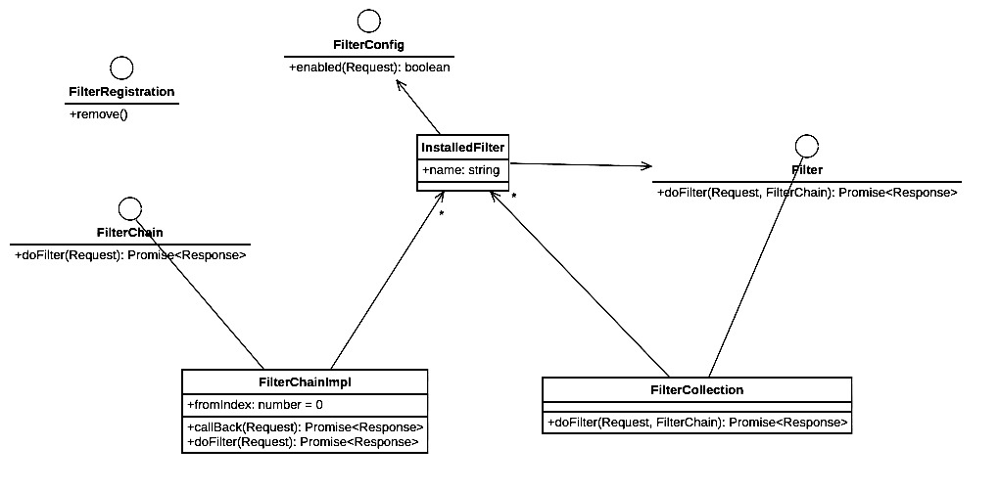

# typescript-http-client
[](https://travis-ci.com/taktik/typescript-http-client)
[](http://standardjs.com)

A simple TypeScript HTTP client with Promise-based API and advanced filtering support

### Basic usage

###### Simple GET request with string response:

```typescript
import expect from 'ceylon';
import { Response, Request, newHttpClient } from 'typescript-http-client'

(async () => {
  // Get a new client
  const client = newHttpClient()
  // Build the request
  const request = new Request('https://jsonplaceholder.typicode.com/todos/1', { responseType: 'text' })
  // Execute the request and get the response body as a string
  const responseBody = await client.execute<string>(request)
  expect(responseBody)
    .toExist()
    .toBeA('string')
    .toBe(`{
  "userId": 1,
  "id": 1,
  "title": "delectus aut autem",
  "completed": false
}`)
})()
```

###### Typed response:

```typescript
import expect from 'ceylon';
import { Response, Request, newHttpClient } from 'typescript-http-client'

class Todo {
  completed: boolean
  id: number
  title: string
  userId: number
}

(async () => {
  // Get a new client
  const client = newHttpClient()
  // Build the request
  const request = new Request('https://jsonplaceholder.typicode.com/todos/1')
  // Execute the request and get the response body as a "Todo" object
  const todo = await client.execute<Todo>(request)
  expect(todo)
    .toExist()
    .toBeA('object')
  expect(todo.userId)
    .toBe(1)
})()
```

### Filters 

Multiple filters can be added to the httpClient, in a certain order, forming a chain of filters.

Filters can be used to:
* Alter any request property (headers, url, body, etc...)
* Alter any response property (headers, body, etc...)
* Short-circuit the chain by returning a custom response without proceeding with the HTTP call, allowing for example for client-side caching.
* Intercept some or all calls for debugging/logging purposes

Filters must implement the `Filter` interface and implement the `doFilter` method:
```typescript
interface Filter<T, U> {
  doFilter(request: Request, filterChain: FilterChain<T>): Promise<Response<U>>
}
```
The `request` parameter contains the request (possibly already modified by previous filters) and can be modified by the filter (or ignored)

The `filterChain` parameter represents the chain of filters following the current filter

###### Filter full example : Transform the response body:

This example transforms the fetched Todos and modify their title

```typescript
import expect from 'ceylon';
import { Response, Request, Filter, FilterChain, newHttpClient } from 'typescript-http-client'

class Todo {
  completed: boolean
  id: number
  title: string
  userId: number
}

// Transform Todos : Alter title
class TodoTransformer implements Filter<Todo, Todo> {
  async doFilter (call: Request, filterChain: FilterChain<Todo>): Promise<Response<Todo>> {
    const response = await filterChain.doFilter(call)
    const todo = response.body
    todo.title = 'Modified title'
    return response
  }
}

(async () => {
  // Get a new client
  const client = newHttpClient()
  // Add our Todo tranformer filter
  client.addFilter(new TodoTransformer(), 'Todo transformer', {
    // Only apply to GET request with URL starting with 
    // 'https://jsonplaceholder.typicode.com/todos/'
    enabled(call: Request): boolean {
      return call.method === 'GET' && 
        call.url.startsWith('https://jsonplaceholder.typicode.com/todos/')
    }
  })
  // Build the request
  const request = new Request('https://jsonplaceholder.typicode.com/todos/1')
  // Execute the request and get the response body as an object
  const todo = await client.execute<Todo>(request)
  expect(todo)
    .toExist()
    .toBeA('object')
  expect(todo.userId)
    .toBe(1)
  expect(todo.title)
    .toBe('Modified title')
})()
```
# Hierarchy of Filters



# Testing
In the tests, you need to first in indicate which name space you are testing, and then precise which method. Both using describe. The entity tested is the first argument of describe.
The second argument of describe, is a function. In the function, you need another function called: it. This function also takes two arguments. The first is a string that is usefull only for future developpers (does nothing in the code) saying what result we expect from our test, and the second is once again a method, ending with an assert this time. This last method is the test.

The hook beforeEach executes before every test.
